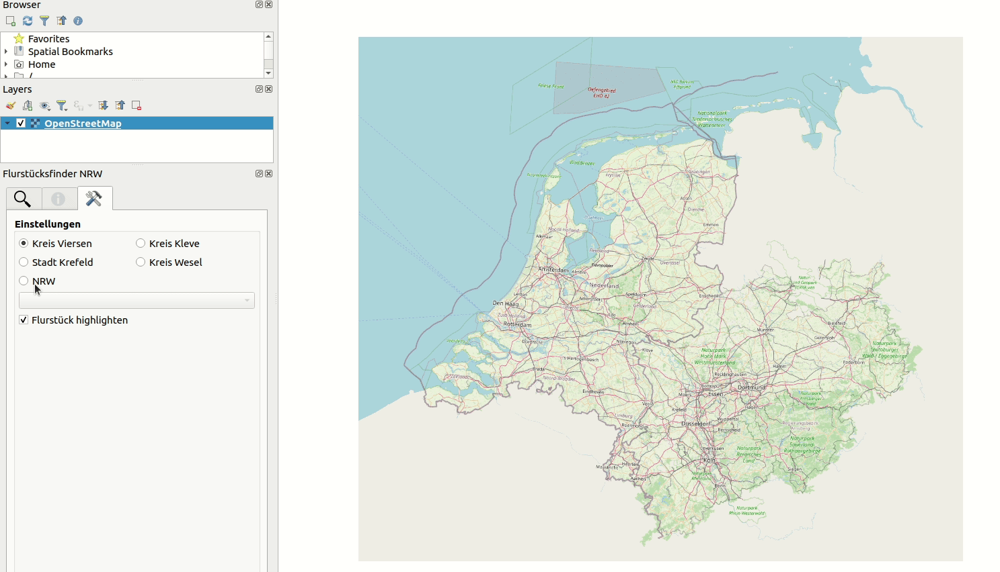
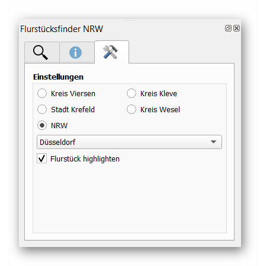
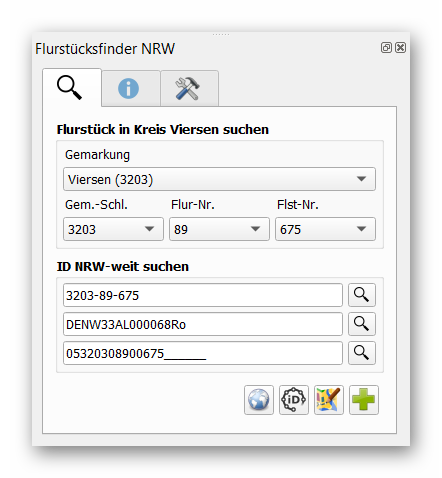
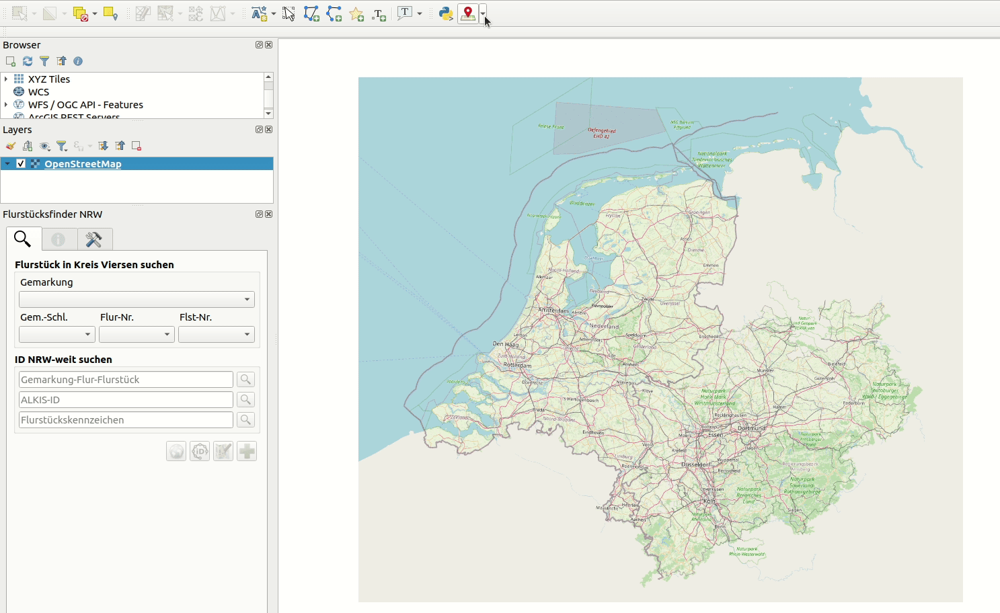

# flurstuecksfinder-nrw

### _QGIS-Plugin zur Suche von Flurstücken in NRW_

## Inhalt
- [Features](#features)
- [Installation](#installation)
- [Verwendung](#verwendung)
  - [Reiter Einstellungen](#reiter-einstellungen)
  - [Reiter Flurstück suchen](#reiter-flurstück-suchen)
  - [Reiter Flurstück Infos](#reiter-flurstück-infos)
  - [Flurstück mit Klick auf die Karte finden](#flurstück-mit-klick-auf-die-karte-finden)
- [Daten](#daten)
  - [Verwendete WFS-Dienste](#verwendete-wfs-dienste)
  - [Katasterämter, Gemarkungen und Fluren](#katasterämter-gemarkungen-und-fluren)
  - [Lizenz der Daten](#lizenz-der-daten)

## Features
- Sucht Flurstücke in NRW
  - durch Auswahl von Katasteramtsbezirk, Gemarkung, Flur, Flurstück
  - durch Klick auf die Karte
  - durch Eingabe des Flurstückskennzeichens, eines verkürzten Kennzeiches oder der ALKIS-ID
- Abruf von Flurstückinfos
- Hinzufügen des Flurstückpolygons als Layer in QGIS
- Verknüpfung von OpenStreetMap-Editoren ([iD] und [JOSM])
- Verknüpfung zu [TIM-online] bzw. zum [Geoportal Niederrhein]

## Installation

Das Plugin ist im offiziellen [QGIS-Plugin-Repository] enthalten und kann in QGIS über das Hauptmenü (*Erweiterungen -> Erweiterungen verwalten und installieren*) installiert und auch bei Verfügbarkeit einer neuen Version aktualisiert werden.

## Verwendung

### Reiter Einstellungen

Hier kann der Katasteramtsbezirk (z.B. Stadt, Kreis, Städteregion) im Bereich "Einstellungen" ausgewählt werden.

- **NRW:** 
  Auswahl des Kastasteramtsbezirks über das Dropdown-Menü, Flurstückssuche auf Basis des NRW-WFS-Dienstes.  
  Anmerkung: Das Werkzeug [Flurstück mit Klick auf die Karte finden](#flurstück-mit-klick-auf-die-karte-finden) funktioniert landesweit auch ohne explizite Auswahl eines Katasteramtsbezirks.

- **Kreis Viersen, Kleve, Wesel und Stadt Krefeld:** 
  Flurstückssuche auf Basis des enstprechenden KRZN-WFS-Dienstes (wochenaktuell).

Die Option "Flurstück highlighten" markiert das Flurstück. Die Markierung wird so lange angezeigt bis das Plugin geschlossen oder ein neues Flurstück gesucht wird. Wird die Option deaktiviert, so wird nur der Umring des Flurstücks kurz blinkend hervorgehoben.

### Reiter Flurstück suchen

Im Reiter „Flurstück suchen“ gibt es mehrere Möglichkeiten, um nach einem Flurstück zu suchen:

1. Über die Dropdown-Menüs Gemarkung, Gemarkungsschlüssel, Flurnummer und Flurstücksnummer
2. Direkte Suche über das verkürzte Kennzeichen Gemarkung-Flur-Flurstück (z.B. `3230-1-1`)
3. Über die ALKIS-ID (z.B. `DENW33AL00009NPL`)
4. Über das Flurstückskennzeichen, z.B. `05320308900675______` (20 Zeichen)

Bei Variante 1 stehen nur Elemente zur Auswahl, die auf dem WFS-Server vorhanden sind.
Variante 2, 3 und 4 ermöglichen die direkte Suche über ein Kennzeichen oder eine ALKIS-ID. Die Suche muss hier mit einem Klick auf das Lupen-Symbol ausgeführt werden.

Sobald ein gültiges Flurstück ausgewählt oder gesucht wurde, werden die Knöpfe freigeschaltet und das ausgewählte Flurstück im Kartenfenster angesteuert.

#### Funktionsknöpfe
| Funktionsknopf | Funktion |
|--|--|
|   | Das Globus-Symbol öffnet [TIM-online] (bei Verwendung des NRW-WFS) bzw. das [Geoportal Niederrhein] (bei Verwendung des KRZN-WFS für Kreis Viersen, Kleve, Wesel oder Stadt Krefeld) an der Position des gewählten Flurstücks. |
|   | Das iD-Symbol stellt eine Verbindung zum OpenStreetMap [iD]-Editor her. Zur Bearbeitung ist ein kostenloses  [OpenStreetMap-Benutzerkonto] erforderlich.|
|   | Das Karten-Symbol stellt eine Verbindung zu [JOSM] (Java OpenStreetMap Editor) her (diese Funktion sollte nur genutzt werden, wenn JOSM auf dem Endgerät installiert ist). Zur Bearbeitung ist ein kostenloses  [OpenStreetMap-Benutzerkonto] erforderlich.|
|   | Durch einen Klick auf das Plus-Symbol kann das Polygon des Flurstücks dem Kartenbild hinzugefügt werden. |
|   |  Durch das Minus-Symbol wird das mit Klick auf das Plus-Symbol hinzugefügte Flurstück wieder entfernt. |

### Reiter Flurstück Infos

Im Reiter Flurstück Infos können die Informationen des WFS-Dienstes zum betreffenden Flurstück angezeigt werden.
Mit einem Rechtsklick in eine Zelle kann der jeweilige Zellenwert in die Zwischenablage kopiert werden.

### Flurstück mit Klick auf die Karte finden

Nach Auswahl des Werkzeugs _Flurstück mit Klick finden_ kann durch einen einfachen Klick auf die Karte das Flurstück an der entsprechenden Stelle gefunden werden.

- Ist **NRW** im [Reiter Einstellungen](#reiter-einstellungen) ausgewählt,  funktioniert die Suche mit Klick auf die Karte landesweit auch ohne explizite Auswahl eines Katasteramtsbezirks.

- Ist **Kreis Viersen, Kleve, Wesel oder Stadt Krefeld** im [Reiter Einstellungen](#reiter-einstellungen) ausgewählt, funktioniert die Suche mit Klick innerhalb der jeweiligen Verwaltungsgrenzen.

## Daten

### Verwendete WFS-Dienste
| Dienst | URL |
| ------ | ------ |
|  ALKIS-AdV-vereinfacht - NRW| [NRW WFS] |
|  ALKIS-AdV-vereinfacht - Kreis Viersen| [VIERSEN WFS] |
|  ALKIS-AdV-vereinfacht - Kreis Wesel | [WESEL WFS] |
|  ALKIS-AdV-vereinfacht - Kreis Kleve | [KLEVE WFS] |
|  ALKIS-AdV-vereinfacht - Stadt Krefeld | [KREFELD WFS] |

### Katasterämter, Gemarkungen und Fluren

Um die Ladezeiten bei der Verwendung des Plugins zu minimieren und die WFS-Server zu entlasten, werden die Daten für die Katasterämter, Gemarkungen und Fluren in NRW (für die diversen Auswahlmenüs im Plugin) automatisiert aufbereitet und im JSON-Format zum Download bereit gestellt. 
Diese JSON-Datei wird lokal im Pluginverzeichnis gespeichert. Beim Start des Plugins wird diese lokal vorgehaltene Datei bei Bedarf aktualisiert.

- [JSON-Datei]
- [GitHub-Repository zur Aufbereitung und Bereitstellung der Daten]

### Lizenz der Daten

Die Daten der verwendeten WFS-Dienste und auch die JSON-Datei stehen als OpenData unter der [Datenlizenz Deutschland – Zero – Version 2.0].

[QGIS-Plugin-Repository]: <https://plugins.qgis.org/plugins/flurstuecksfinder-nrw/>
[iD]: <https://wiki.openstreetmap.org/wiki/DE:ID>
[JOSM]: <https://josm.openstreetmap.de/>
[TIM-online]: <https://www.tim-online.nrw.de/tim-online2/>
[Geoportal Niederrhein]: <https://geoportal-niederrhein.de/>
[OpenStreetMap-Benutzerkonto]: <https://www.openstreetmap.org/user/new>
[NRW WFS]: <https://www.wfs.nrw.de/geobasis/wfs_nw_alkis_vereinfacht?service=WFS&version=1.1.0&request=GetCapabilities>
[Viersen WFS]: <https://geoservices.krzn.de/security-proxy/services/wfs_kvie_alkis_adv_vereinfacht?Service=WFS&Version=2.0.0&Request=GetCapabilities>
[Kleve WFS]: <https://geoservices.krzn.de/security-proxy/services/wfs_kkle_alkis_adv_vereinfacht?Service=WFS&Version=2.0.0&Request=GetCapabilities>
[Wesel WFS]: <https://geoservices.krzn.de/security-proxy/services/wfs_kwes_alkis_adv_vereinfacht?Service=WFS&Version=2.0.0&Request=GetCapabilities>
[Krefeld WFS]: <https://geoservices.krzn.de/security-proxy/services/wfs_skre_alkis_adv_vereinfacht?Service=WFS&Version=2.0.0&Request=GetCapabilities>
[JSON-Datei]: <https://kreis-viersen.github.io/katasteraemter-gemarkungen-fluren-nrw/data/katasteraemter-gemarkungen-fluren-nrw.json>
[GitHub-Repository zur Aufbereitung und Bereitstellung der Daten]: <https://github.com/kreis-viersen/katasteraemter-gemarkungen-fluren-nrw>
[Datenlizenz Deutschland – Zero – Version 2.0]: <https://www.govdata.de/dl-de/zero-2-0>
